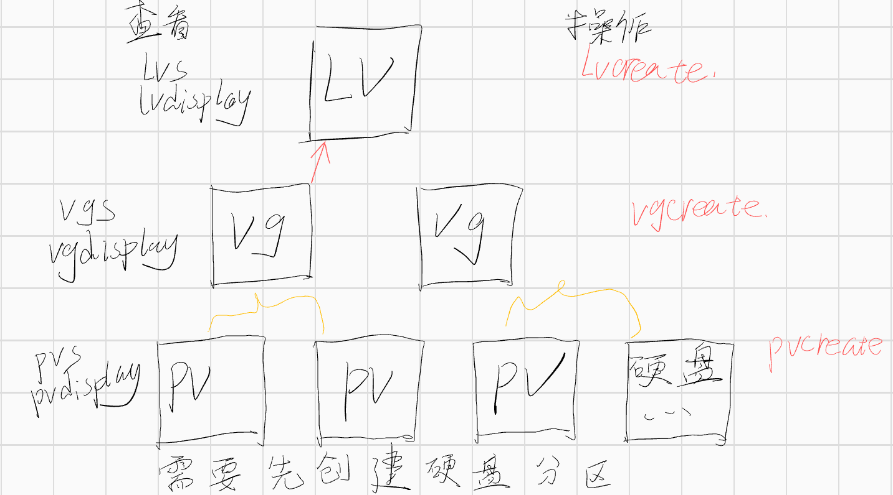

- ## LVM 管理
- > 管理工具 system-storage-manager
  yum install system-storage-manager
  ssm create -s lv大小 -n lv名称 --fstype lv文件类型 -p 卷组名 设备 挂载点
- 需要先理解 LVM 的概念
- 
- 磁盘创建
	- ```bash
	  pvcreate /dev/sdb1
	  vgcreate vgname /dev/sdb1
	  lvcreate -L 50G -n lvdata vgname
	  mkfs.xfs /dev/vgname/lvdata
	  mount /dev/vgname/lvdata /yourdir
	  ```
- 磁盘扩容
	- ```bash
	  vgextend vgname /dev/sdc1
	  
	  # 方式一 扩容到
	  lvextend -L 100G /dev/vgname/lvdata
	  # 方式二 原有基础上增加
	  lvextend -l +100%FREE /dev/mapper/lvdata
	  lvextend -l `vgdisplay vgname | grep "Total PE" | awk '{print $3}'` /dev/mapper/lvdata
	  
	  # resize2fs (ext4)
	  xfs_growfs /dev/vgname/lvdata
	  ```
- 磁盘缩减
	- ```bash
	  # xfs 不支持缩减
	  umount /yourdir
	  resize2fs /dev/vgname/lvdata 50G
	  e2fsck /dev/vgname/lvdata
	  lvreduce -L 50G /dev/vgname/lvdata
	  mount /yourdir
	  ```
- 磁盘删除
	- ```bash
	  umount /yourdir
	  
	  lvremove /dev/*
	  vgremove /dev/*
	  pvremove /dev/*
	  ```
- 脚本
	- ```bash
	  #!/bin/bash -e
	  # author: acdiost
	  
	  DISK="vdb"
	  
	  parted -s /dev/${DISK} mklabel gpt
	  parted -s /dev/${DISK} mkpart primary 0% 100%
	  pvcreate /dev/${DISK}1
	  vgcreate data /dev/${DISK}1
	  lvcreate -L 200G -n mysql data
	  mkfs.ext4 /dev/mapper/data-mysql
	  
	  pvs
	  vgs
	  lvs
	  
	  echo 'successfully'
	  
	  ```